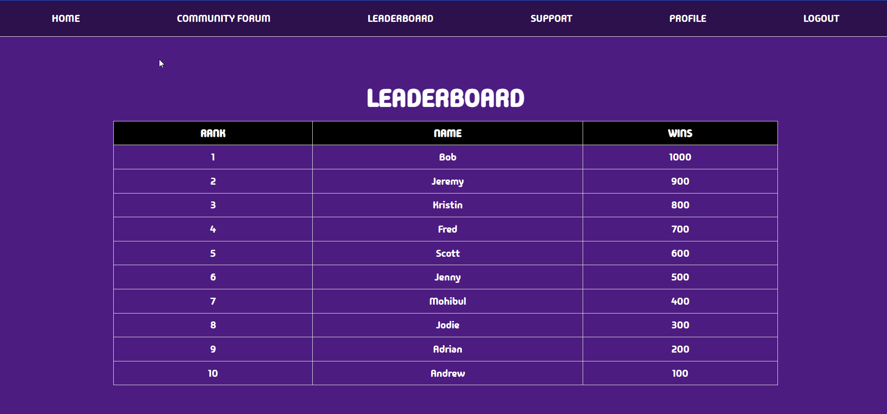
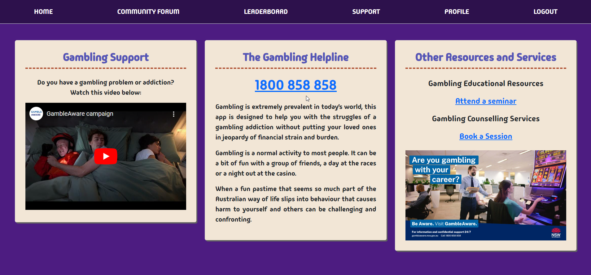
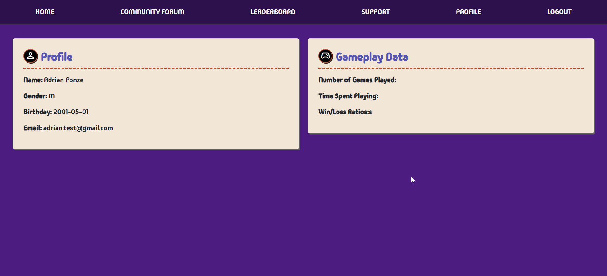

# Wagerless: A game designed to combat Gambling Addiction


## Description

Wagerless is an innovative game designed to promote responsible gambling. This application is a fun and engaging way for players to understand the risks associated with gambling, without the real-world consequences.


          


## Table of Contents

- [Technologies Used](#technologies-used)
- [Installation](#installation)
- [User Story](#user-story)
- [Acceptance Criteria](#acceptance-criteria)
- [Usage](#usage)
- [Contributing](#contributing)
- [License](#license)
- [Questions](#questions)


## Technologies Used

- Javascript
- Express.js (4.18.2)
- Node.js
- Handlebars
- MySQL2 (3.9.1)
- Express Session (3.1.0)
- Express Handlebars (1.18.0)
- Bcrypt (5.1.1)
- Dotenv (16.4.4)
- Suquelize (6.37.1)
- ConnectSessionSequelize (7.1.7)


## Installation

When trying to install this application, do the following:

1. Download the code from the repository in GitHub found here: https://github.com/Y1va/Wagerless
<br>
2. `npm init -y`: This will create a package.json file
<br>
3. `npm i`: To install dependencies
4. Once the necessary dependencies have been downloaded, be sure to initialise mySQL and source the schema.sql file in the /db directory
5. Run npm start to fire up the server

If the above has been done correctly, the application should run in the local environment without issues. Example: (http://localhost:3001)


## User Story

```
AS A User who is looking for ways to stop my gambling addiction but is struggling where to find help
I WANT a Rock, Paper, Scissors game that helps combat gambling addiction
SO THAT I can learn about responsible gambling in a fun and engaging way.
```

## Acceptance Criteria
```
GIVEN an application called Wagerless
WHEN I vist the site for the first time
THEN I am presented with a home page that reads Wagerless alongside with the options to Login or Register
WHEN I click on the login option 
THEN I am presented with the options to input my username and password as well as a forgot password and login button
WHEN I want to register as a new player
THEN I have options to sign up and create a new account
WHEN I navigate to the login page as a new user
THEN I should be able to log in with my credentials
WHEN I navigate to the home page
THEN I have the option to start and play the game
WHEN I make a choice of rock, paper or scissors
THEN The game should start the round against the CPU and show the result
WHEN Either a player or the CPU gets to five points
THEN The game should end alerting the player who won
WHEN I visit the profile section
THEN I can view my gameplay data as well as the settings
WHEN I visit the leaderboard section
THEN I can see all recent players and their score
WHEN I go to the Community Forum section
THEN I can see multiple forums and discusisons
WHEN I go to the Support section
THEN I am given links and resources on where to seek gambling addiction support
```

## Usage

Landing Page of Wagerless:


Community Forum:


Leaderboard:



Support:



Profile:




## Contributing

- Jodie Lee: [GitHub](https://github.com/jodielee062788)
- Adrian Ponze: [GitHub](https://github.com/Y1va)
- Mohibul Haque: [GitHub](https://github.com/MahabaHubba)
- Andrew Tran: [GitHub](https://github.com/AndrewDotTee)


## License

This project is license under the MIT license